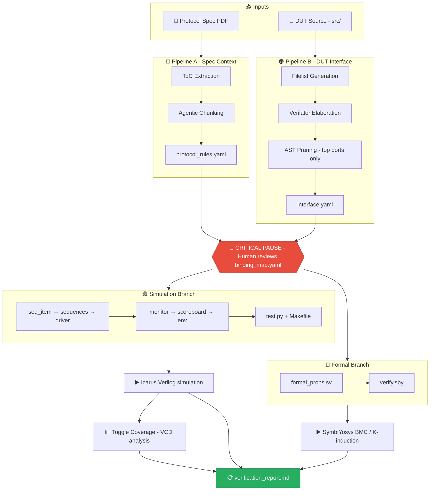
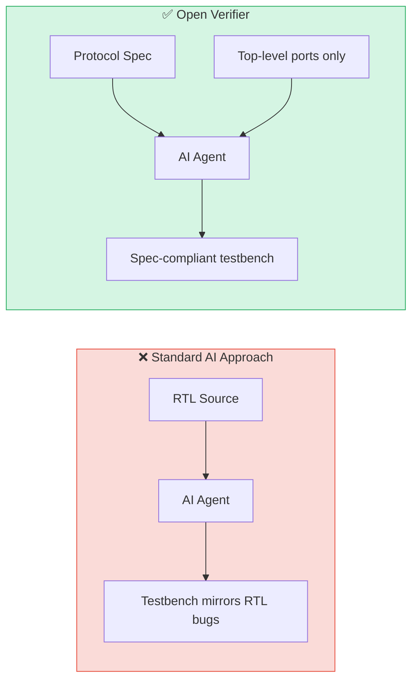
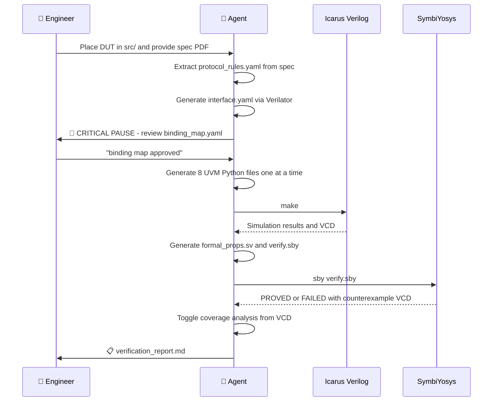
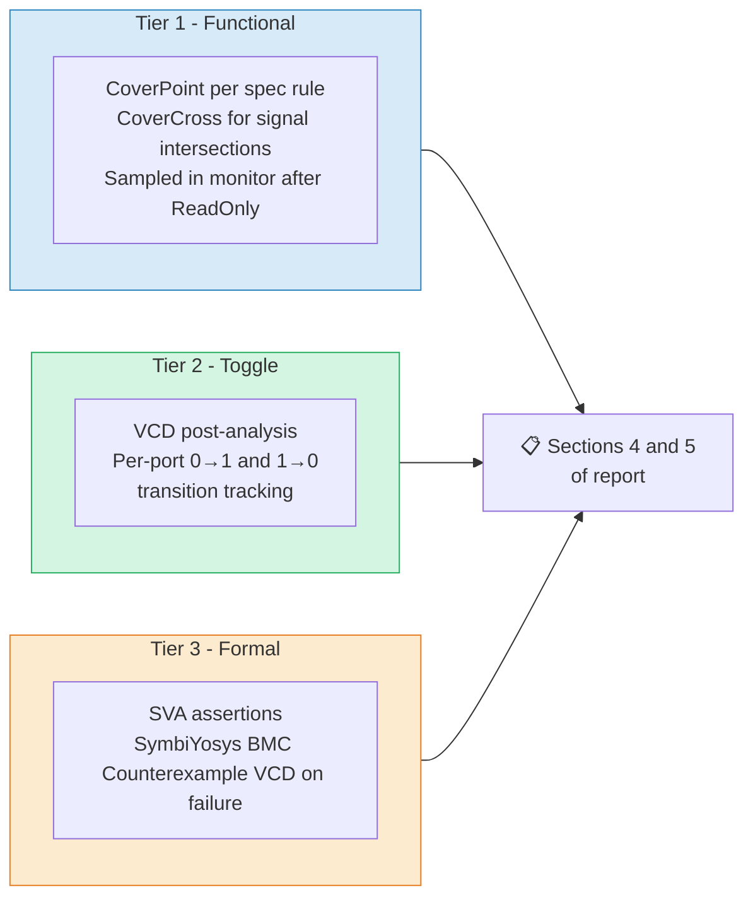
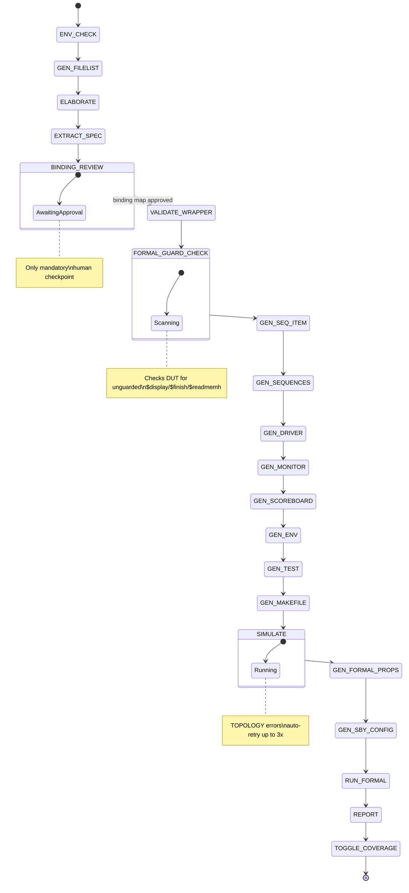

# 🔬 Open Verifier

### AI-driven black-box UVM verification for Verilog & SystemVerilog


> **You provide the DUT and the spec PDF.
> The agent generates the entire UVM testbench, runs simulation and formal verification, and delivers a coverage report - without ever reading your RTL.**

---

## ⚡ What Makes This Different

| | Traditional AI Verification | **Open Verifier** |
|---|:---:|:---:|
| Reads RTL source | ✅ causes design-intent bias | ❌ **Never** |
| Spec-driven test generation | ❌ | ✅ |
| Full UVM methodology | ❌ | ✅ pyUVM + cocotb |
| Formal verification | ❌ | ✅ SymbiYosys BMC + K-induction |
| Functional coverage | ❌ | ✅ Mapped to spec rules |
| Toggle coverage | ❌ | ✅ VCD post-analysis |
| Single human checkpoint | ❌ | ✅ Binding map review only |
| Open toolchain | Varies | ✅ 100% open source |

---

## 🏗️ Architecture

Two isolated deterministic pipelines gather context before any generation begins - the spec is never mixed with the RTL.



---

## 🔒 The Black-Box Principle



The agent is explicitly prohibited from reading `src/`. Its only behavioral source of truth is the extracted spec YAML.

---

## 🔄 Run Flow



---

## 📊 Coverage - Three Tiers



Tier 1 catches protocol compliance failures. Tier 2 catches untested signal paths. Tier 3 proves properties hold for all reachable states within the BMC bound.

---

## ⚙️ The 20-Step FSM

One step per agent turn. Each step is validated and checkpointed to `out/state.json` - interrupted runs resume from the last completed step.



---

## 📦 Repo Structure

```
open-verifier/
├── .agents/skills/open-verifier/
│   ├── SKILL.md                       ← Agent FSM - 20-step pipeline
│   └── scripts/
│       ├── 00_check_env.sh            ← Toolchain validation
│       ├── 01_gen_filelist.py         ← Scans src/, writes dut.f
│       ├── 02_elaborate.py            ← Verilator AST → interface.yaml
│       ├── 03_extract_spec.py         ← PDF chapter extraction
│       ├── 03a_fetch_adjacent_pages.py← Page-boundary context window
│       ├── 04_validate_step.py        ← Per-file symbol validation
│       ├── 05_check_top_wrapper.py    ← Port diff vs interface.yaml
│       ├── 06_view_waves.sh           ← GTKWave launcher
│       ├── 06b_formal_guard_check.py  ← Scans DUT for unguarded sim tasks
│       ├── 07_run_formal.sh           ← SymbiYosys runner (180s timeout)
│       ├── 08_toggle_coverage.py      ← VCD → toggle coverage table
│       ├── 99_reset.sh                ← Clean all generated artifacts
│       └── update_state.py            ← State.json CLI updater
│
├── src/                               ← Your DUT files (Agent doesnt read these files)
│
├── out/                               ← Generated artifacts (gitignored)
│   ├── dut.f
│   ├── interface.yaml
│   ├── protocol_rules.yaml
│   ├── binding_map.yaml
│   └── state.json                     ← FSM checkpoint - enables resume
│
└── uvm_tb/                            ← Agent-generated testbench (gitignored)
    ├── seq_item.py
    ├── sequences.py
    ├── driver.py
    ├── monitor.py
    ├── scoreboard.py
    ├── env.py
    ├── test.py
    ├── Makefile
    ├── formal/
    │   ├── formal_props.sv
    │   └── verify.sby
    └── verification_report.md
```

---

## 🚀 Quick Start

**Prerequisites**

```bash
# Ubuntu / WSL
sudo apt install verilator iverilog gtkwave python3-pip -y
pip install cocotb==1.8.1 pyuvm==2.8.0 cocotb-coverage PyMuPDF pyyaml

# Optional - enables formal verification (Tier 3)
# Use oss-cad-suite tarball — do NOT use apt packages (outdated, causes GLIBC conflicts)
cd ~
wget https://github.com/YosysHQ/oss-cad-suite-build/releases/latest/download/oss-cad-suite-linux-x64.tgz
tar -xzf oss-cad-suite-linux-x64.tgz
source ~/oss-cad-suite/environment   # Add to ~/.bashrc for persistence
```

**Run**

1. Clone this repo and open it in a supported agentic IDE (Cursor, Windsurf, Antigravity)
2. Place your DUT `.v` / `.sv` files in `src/`
3. Have your protocol spec PDF accessible
4. Say: **"verify my DUT against the spec"**

The agent reads `SKILL.md` and runs the full 20-step pipeline automatically, pausing once for your binding map review.

---

## 🛠️ Toolchain

| Layer | Tool | Purpose |
|:---:|:---:|:---|
| Simulation | [Icarus Verilog](http://iverilog.icarus.com) | Compile and simulate DUT |
| Testbench | [cocotb 1.8](https://cocotb.org) | Python coroutine interface to simulator |
| UVM | [pyUVM 2.8.0](https://github.com/pyuvm/pyuvm) | Python UVM component framework |
| Coverage | [cocotb-coverage](https://github.com/mciepluc/cocotb-coverage) | CoverPoint and CoverCross decorators |
| Formal | [SymbiYosys](https://symbiyosys.readthedocs.io) | Bounded model checking (optional) |
| SMT Solver | [Z3](https://github.com/Z3Prover/z3) | Formal backend |
| Interface | [Verilator](https://www.veripool.org/verilator/) | AST extraction only, not simulation |
| Spec parsing | [PyMuPDF](https://pymupdf.readthedocs.io) | PDF ToC and page rendering |
| Waveforms | [GTKWave](https://gtkwave.sourceforge.net) | VCD viewer |

---

## 📜 License

MIT - see [LICENSE](LICENSE)

---

*Open Verifier never reads your source. That's the guarantee.*
